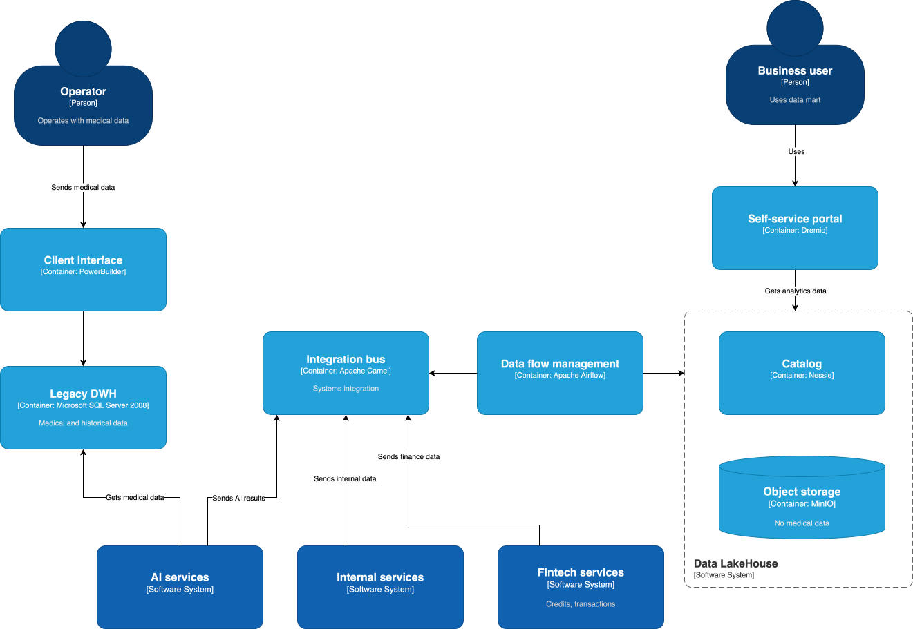

## Архитектура системы через год

## Проблемные места

| Проблема | Описание     | Последствия   |
| -------- | ------------ | ------------- |
| Отстутствие витрины данных | Затрудненный поиск данных, нет возможности посмотреть срез данных | Снижает производительность |
| Долгое построение отчетов | Из-за большого количества данных (сотни терабайт) и вариантов их использования отчеты составляются часами | Замедляется time-to-market |
| Устаревшие технологии | Поддержка SQL Server 2008 прекращена в 2019 году, используется устаревший PowerBuilder | Возникают риски безопасности и снижения производительности |
| Возрастающая сложность интеграции с помощью Apache Camel | С ростом количества систем усложняется их интеграция | Плохая масштабируемость |
| Вынужденная интеграция новых систем с легаси-системами | Современные сервисы ИИ и финтеха интегрируются с DWH | Сложность поддержки, риск ошибок |
| Нет разделения на бизнес-домены | Данные разных категорий хранятся в одной БД | Риск ошибок, сложное масштабирование |
| Отсутствие изоляции чувствительных данных | Медицинские данные хранятся в одном месте со всеми остальными данными | Риски избыточного доступа к чувствительным данным |

## Приоритизация проблем

Проблемы можно приоритизировать с помощью метода MoSCoW:

### Must Have

| Проблема | Обоснование  |
| -------- | ------------ |
| Отстутствие витрины данных | Бизнес поставил эту задачу перед архитектором |
| Отсутствие изоляции чувствительных данных | Нарушение требований законодательства о персональных данных |

### Should Have

| Проблема | Обоснование  |
| -------- | ------------ |
| Нет разделения на бизнес-домены | Бизнес хочет развивать все направления независимо |
| Долгое построение отчетов | Бизнес отдельно отметил эту проблему |
| Устаревшие технологии | Мешает развитию систем |
| Вынужденная интеграция новых систем с легаси-системами | Мешает развитию систем |

### Could Have

| Проблема | Обоснование  |
| -------- | ------------ |
| Возрастающая сложность интеграции с помощью Apache Camel | На перспективу |

### Won't Have

\-
