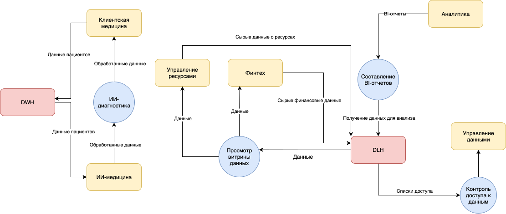

## Разделение на домены

| Домен | Описание | Ответственные | 
| ----- | -------- | ------------- |
| Клиентская медицина | Управление медицинскими картами, исследованиями пациентов | Клиники |
| ИИ-медицина | ИИ-сервисы для работы с медицинскими данными | ML-разработчики |
| Финтех | Банковская система, управление финансовыми транзакциями | Fintech-специалисты |
| Управление ресурсами | Плафторма ERP, управление персоналом и материальными ресурсами | Бэк-офис |
| Аналитика | BI-отчеты, витрина данных | Специалисты по data sсience |
| Управление данными | Data lineage, data governance | Экспертная группа data governance |

## Data Flow Diagram

## Преимущества данного разделения на домены

1. Независимость систем:
    - каждая система может разрабатываться независимо, что позволяет параллелить работу;
    - системы перестают зависеть от сложной бизнес-логики DWH;
    - облегчается добавление нового бизнеса (домена);
    - данные изолированы друг от друга по смыслу, что уменьшает риск ошибок.

2. Безопасность:
    - уменьшается риск утечки медицинских данных за счет изоляции от систем, которым не нужен доступ;
    - BI-отчеты строятся только на определенных данных, разрешенных для анализа.

3. Отказоустойчивость:
    - Устранение единой точки отказа в виде DWH, содержащей много бизнес-логики для многих систем.

4. Производительность:
    - Построение BI-отчетов должно ускориться за счет создания витрин данных доменов.

5. Доверие к данным:
    - Поиск данных становится проще после внедрения витрин, становится понятным происхождение данных;
    - Повышается качество данных благодаря назначению ответственных за область данных.
