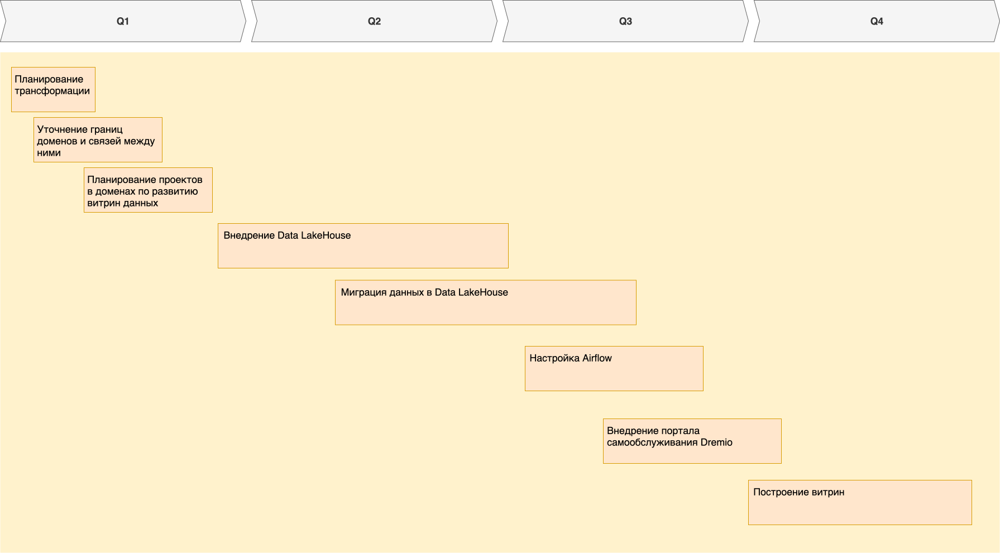

## Технический радар

| Технология  | Статус | Комментарий |
| ----------- | ------ | ----------- |
| Data stores |
| Microsoft SQL Server 2008 | Hold | Постепенный уход от технологии |
| MinIO | Adopt | Объектное хранилище для данных систем |
| Data management |
| Airflow | Adopt | Управление потоками данных |
| Apache Camel | Hold | Из-за сложностей интеграции планируется отказ в будущем |
| Apache Kafka | Assess | Вероятный переход с Apache Camel |
| Dremio | Adopt | Панель самообслуживания |
| Nessie | Adopt | Транзакционный каталог |
| PowerBI | Hold | Постепенный уход от технологии из-за возможных проблем с масштабированием под новые системы |
| Languages |
| Python | Adopt | Современный язык для ML |
| PowerBuilder | Hold | Устаревшая IDE для разработки |
| Infrastructure |
| Docker | Adopt |  |
| Kubernetes | Adopt | Управление контейнеризованными приложениями |
| Prometheus | Trial | Планируется внедрение в будущем для наблюдаемости |

## Технический роадмап

## Обоснование изменений

- Планирование трансформации - требуется детальная проработка архитектуры трансформации для выявления узких мест на раннем этапе;
- Уточнение границ доменов и связей между ними - поможет разделить ответственность между разными областями для дальнейшего создания витрин данных;
- Планирование проектов в доменах по развитию витрин данных - необходимо определение вектора развития в доменах для реализации витрин;
- Внедрение Data LakeHouse - этап подготовки и настройки систем хранения и управления данными для создания витрин данных;
- Миграция данных в Data LakeHouse - заполнение нового хранилища существующими данными для витрин, чтобы была возможность учитывать исторические данные при составлении отчетов;
- Настройка Airflow - создание механизма управления потоками данных от поставщиков систем к хранилищу, который повысит эффективность управления данными;
- Внедрение портала самообслуживания Dremio - этап создания портала для бизнес-пользователей, дающего самостоятельный доступ к данным;
- Построение витрин - итоговый этап, который предоставит бизнесу витрины данных, ускоряющий составление отчетов.
